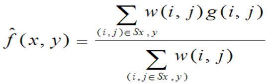
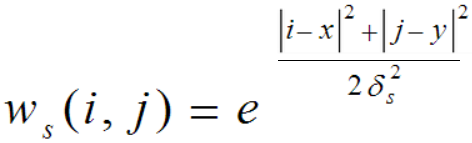
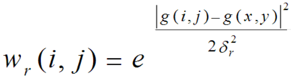
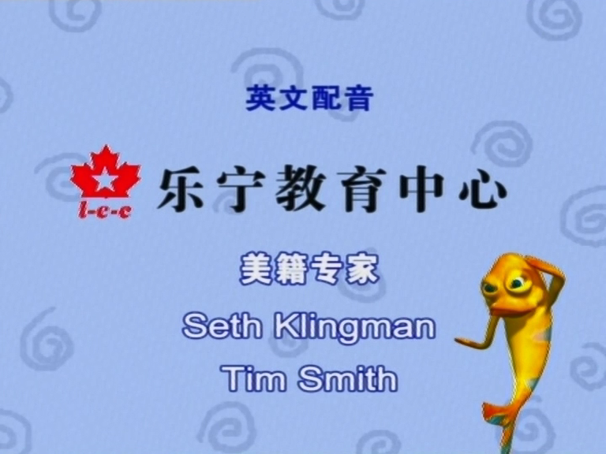
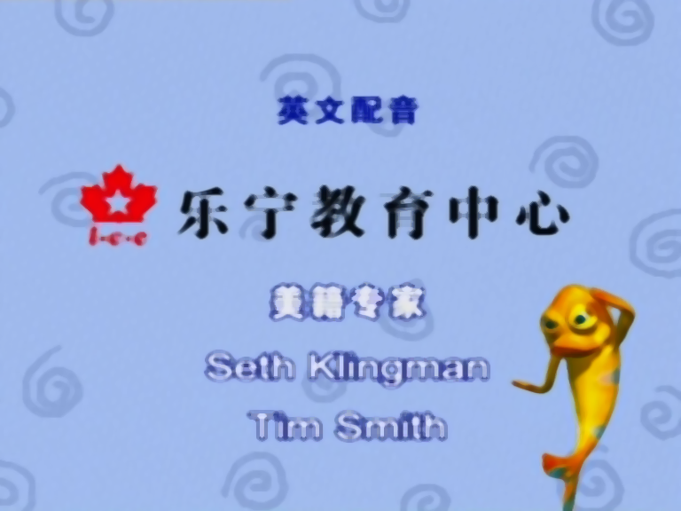
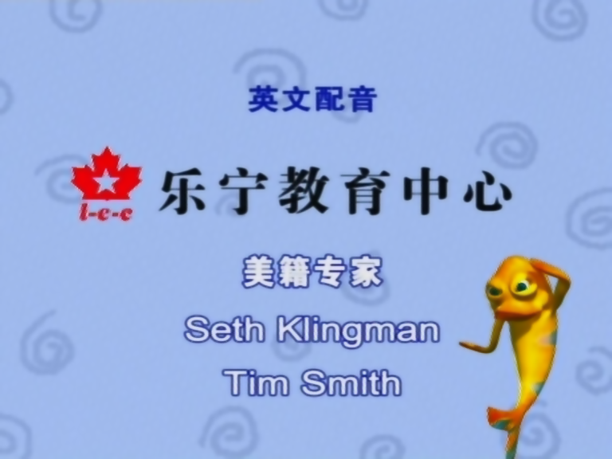

#图像边缘去锯齿
本项目简要实现了五种方式实现图像去锯齿

out文件夹下分别存储了这五种Demo的计算结果示意图

blur文件夹下面是代码

## 1.中值滤波算法
该算法简要概括为：使用滤波核方框内的中值像素值代替原像素值

## 2.高斯滤波算法
使用一个具有空间二维高斯分布的卷积核进行卷积
## 3.双边滤波算法
在高斯滤波的基础之上考虑像素值的分布，再对应相乘一个值域上的高斯分布(计算邻域像素值与中心像素值的差，该差值可以想象成空间一维距离，再根据这个差值计算高斯分布对应的y值，计算该邻域像素点对中心像素值的贡献)。

最终计算公式

邻域空间高斯分布权重

像素值域高斯权重分布的计算公式

## 4.导向滤波算法
何凯明提出的导向滤波，大一开始做图像研究的时候有过类似想法。核心出发点，如何平滑非边缘区域与保留边缘信息。当时我分别使用了方差衡量是否为边缘区域，后面就看见了导向滤波的实现。。。

## 5.图像放大  &  双边滤波算法

考虑到图像锯齿可能是某个邻域内像素值全为一个值，且跳跃性过大，过于离散化。因此先采用插值方法resize到较大的尺寸，再使用滤波方法进行滤波，以降低锯齿的离散程度，从而使得图像边缘看起来较为平滑。

## 6.未解决的问题  &&  可能有效的方式(未实现) 

观察以下图片，可以发现原图的背景水图案被滤波算法模糊

对于去锯齿任务：通常情况下只有边缘处会出现锯齿条纹，所以可以使用边缘提取的算法提取边缘，再借助边缘图作为参考对图像边缘进行滤波算法。

## 7.部分结果示意图(以第5张图片为例)

原图

中值滤波

双边滤波

高斯滤波

放大&双边滤波

导向滤波

